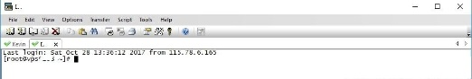

**TÌM HIỂU MỘT SỐ PHẦN MỀM DÙNG CHO SSH TRÊN LINUX (putty, Mobaxterm, SecureCRT ...)**

1. **Hướng dẫn sử dụng phần mềm putty trên Windows**

Putty là phần mềm miễn phí, được cài trên các hệ điều hành windows để truy cập vào các máy chủ linux hoặc các thiết bị mạng có hỗ trợ giao thức SSH.

Bài viết này sẽ hướng dẫn bạn: Cài đặt phần mềm putty trên windows 10 64bit.
Hướng dẫn sử dụng putty để truy cập vào một máy linux (Centos hoặc Ubuntu …) và một thiết bị mạng.

Yêu cầu cần phải có là: Máy chủ đã cài SSH server hoặc thiết bị mạng đã được khai báo để truy cập thông qua SSH.

## 1. Tải và cài đặt Putty[**#**](https://blog.cloud365.vn/windows/huong-dan-cai-dat-va-su-dung-putty/#1-tai-va-cai-%C4%91at-putty)
## Tải file cài đặt[**#**](https://blog.cloud365.vn/windows/huong-dan-cai-dat-va-su-dung-putty/#tai-file-cai-%C4%91at)
Truy cập website: https://www.putty.org/

Lựa chon cho hệ điều hành windows và tải xuống. Chọn mục số 2 như hình dưới.

Sau đó sẽ được điều hướng sang trang mới, tiếp tục chọn mục như ảnh bên dưới để download bộ cài của putty, máy sẽ hỏi bạn lưu ở đâu.

### Cài đặt Putty
Bắt đầu cài đặt

Click vào file vừa tải về, sau đó chọn Next

Để mặc định các gợi ý cài đặt và chọn Next tiếp theo.

Chọn Install để cài đặt putty

Sau đó chọn Finish để kết thúc việc cài đặt putty.

## 2. Thao tác sử dụng cơ bản[**#**](https://blog.cloud365.vn/windows/huong-dan-cai-dat-va-su-dung-putty/#2-thao-tac-su-dung-co-ban)
### 2.1. Thực hiện ssh tới một server linux
Khởi động putty từ desktop hoặc từ thanh menu của windows. Ta sẽ có màn hình giao diện của putty. Sau đó bắt đầu nhập các thông số cần thiết như ảnh bên dưới, bao gồm:

- Địa chỉ IP của máy chủ muốn remote
- Port của giao thức SSH, thường là 22 nếu ta không thay đổi gì.

Bạn thực hiện theo các bước trong hình ở dưới:

- Bước 1: Lựa chọn giao thức kết nối SSH
- Bước 2: Nhập IP máy chủ ssh server
- Bước 3: Nhập port kết nối SSH của server.
- Bước 4: Kết nối

Sau đó chọn Open, ta sẽ có cửa sổ mới hiện ra, sau đó nhập user là root hoặc user khác nếu ta đã tạo trước đó. Trong ví dụ này là user root.

Nhập tiếp mật khẩu của user root để thực hiện đăng nhập vào máy chủ linux.
### 2.2. Thực hiện telnet tới một switch
Lựa chon giao thức telnet, nhập địa chỉ IP switch, port telnet của switch

- Port của giao thức Telnet, mặc định là 23.

Bạn thực hiện theo các bước trong hình ở dưới:

- Bước 1: Lựa chọn giao thức kết nối Telnet
- Bước 2: Nhập IP thiết bị switch
- Bước 3: Nhập port kết nối Telnet của server.
- Bước 4: Kết nối

Sau đó chọn Open, ta sẽ có cửa sổ mới hiện ra, sau đó nhập password để truy cập vào switch.

1. **Hướng dẫn sử dụng MobaXterm trên windows**

Khi làm việc với các hệ điều hành như Linux, Windows… hay quản trị các thiết bị mạng Switch, Router việc truy cập quản lý, thao qua kết nối console là vô cùng bất tiện. Hiện nay có nhiều phần mềm miễn phí hỗ trợ bạn thực hiện truy cập từ xa, thao tác một cách chủ động như Putty, SecureCRT… Bài viết dưới đây sẽ hướng dẫn các bạn sử dụng công cụ MobaXterm được cài đặt trên hệ điều hành Windows để SSH, telnet, remote từ xa tới thiết bị của mình và một số tính năng hỗ trợ bổ sung khác.

## 1. Tải và cài đặt MobaXterm[**#**](https://support.cloud365.vn/cloud-server/huong-dan-su-dung-mobarxterm-tren-windows/#1-t%E1%BA%A3i-v%C3%A0-c%C3%A0i-%C4%91%E1%BA%B7t-mobaxterm)
Truy cập https://mobaxterm.mobatek.net/download.html

Lựa chọn bản miễn phí cho hệ điều hành windows để tải xuống - giải nén - cài đặt.

**Bắt đầu cài đặt**

Click vào file vừa tải về, sau đó chọn Next

Đồng ý với điều khoản sử dụng phần mềm

Để mặc định các gợi ý cài đặt và chọn Next tiếp theo

Chọn Install để cài đặt MobaXterm

Sau đó chọn Finish để kết thúc việc cài đặt MobaXterm.

Cài đặt thành công
## 2. Thao tác sử dụng[**#**](https://support.cloud365.vn/cloud-server/huong-dan-su-dung-mobarxterm-tren-windows/#2-thao-t%C3%A1c-s%E1%BB%AD-d%E1%BB%A5ng)
### 2.1. Thực hiện ssh tới một server linux
Thực hiện khởi động MobaXterm từ desktop hoặc từ thanh menu của windows.

Thao tác connect tới server của bạn

Click Session -> SSH -> Nhập các thông tin server (IP, username, port) -> OK

Thường thì các server có port SSH mặc định là 22 người quản trị có thể thay đổi port để nâng cao bảo mật bạn chú ý nhập đúng thông tin port.

Nhập mật khẩu kết nối tới server của bạn. Một điều chú ý khi nhập mật khẩu sẽ không hiển thị dấu \*\*\*\*\*\*\*\* như các công cụ khác bạn nhập chính xác hoặc bạn có thể paste mật khẩu vào màn hình ở dưới.

Kết nối ssh thành công

### 2.2. Thực hiện telnet tới một thiết bị mạng
Bạn có thể thực hiện telnet tới một thiết bị mạng để thao tác cấu hình, cụ thể dưới đây kết nối tới thiết bị Switch theo giao thức telnet. Port mặc định của telnet là 23.

Click Session -> Telnet -> Nhập các thông tin server -> OK

Nhập mật khẩu của thiết bị. Mật khẩu không hiển thị dạng \*\*\*\*\*\*\*\* bạn nhập chính xác mật khẩu hoặc paste vào màn hình ở dưới.

Vậy bạn đã kết nối từ xa tới Switch thành công.
### 2.4. Một số tính năng khác MobaXterm hỗ trợ
**Network scan**: Tính năng MobaXterm hỗ trợ để scan các IP trong cùng dải mạng

Click Tools -> Network scanner -> Nhập thông tin về network của bạn muốn kiểm tra.

Kết quả cho bạn là trong dải mạng của bạn có những IP nào đang online, đang hoạt động qua giao thức nào.

**Port scan**: Kiểm tra xem một server đang mở những port nào.

Click Tools -> Ports scanner -> Nhập thông tin IP bạn muốn kiểm tra.

Kết quả là server kiểm tra đang mở port nào.

Trên là những hướng dẫn cơ bản cho bạn để sử dụng công cụ MobaXterm.
1. # **Hướng dẫn dùng ZOC Terminal kết nối SSH**
Tương tự như PuTTY, **ZOC Terminal** cũng là một công cụ sử dụng giao thức SSH để giúp bạn kết nối vào VPS và tiến hành cài đặt, chỉnh sửa.

Cá nhân mình thích sử dụng ZOC Terminal nhiều hơn PuTTY do chương trình này hỗ trợ nhiều chức năng, bảo mật hơn (có thể cài password khởi động) và nhất là sử dụng được Ctrl+C, Ctrl+V.

**Đăng nhập VPS sử dụng ZOC Terminal**

\1. Tải về, cài đặt và chạy chương trình. Cửa sổ login sẽ như bên dưới:

\2. Trong Connect to điền thông tin server và Port

\3. Connection type chọn Secure Shell

\4. Emulation chọn Linux

\5. Tiếp theo điền Username và Password vào, có thể chọn Save password để lần sau không phải nhập nữa

\6. Cuối cùng nhấn Connect để kết nối với server

\7. Nếu đăng nhập thành công sẽ có thông báo Welcome xuất hiện

`     `**4. tìm hiểu về SecureCRT**

SecureCRT là phần mềm bảo mật dữ liệu quan trọng trong máy tính, cung cấp cho người sử dụng các tính năng và sự lựa chọn hoàn hảo cho việc bảo mật thông tin các dữ liệu quan trọng trên máy tính cá nhân, hỗ trợ người dùng truy cập an toàn từ xa, truyền tập tin và dữ liệu qua đường truyền an toàn chống rò rỉ thông tin đến cho người nhận.

 

SecureCRT – bảo mật dữ liệu máy tính

Ứng dụng sử dụng công cụ mã hóa rất mạnh mẽ với rất nhiều sự lựa chọn xác nhận sử dụng để bảo vệ mật khẩu, tài khoản người dùng cũng như các dữ liệu và hệ thống máy tính.

Hỗ trợ mô phỏng rất nhiều console như VT100, ANSI, Xterm, VT102, VT220, ANSI, SCO và thậm chí là Linux. Nó giúp người dùng tự động thực hiện các hoạt động hàng ngày để người dùng không phải lo ngại về việc tự mình thực thi chúng.

` `SecureCRT 6.5 full cung cấp quản lý, cấu hình và tùy chỉnh với quyền kiểm soát các file scrollback, màu sắc, phông chữ. Ứng dụng này có khả năng hỗ trợ người dùng truy cập các thiết bị mạng từ một khách hang khác với SSH2, Telnet, Telnet / SSL, SSH1 và nhiều giao thức khác.

` `Quản lý việc tùy chọn các file, quản lý nhiều kết nối

Tính năng chính SecureCRT

Hỗ trợ người dùng truy cập an toàn các ứng dụng kinh doanh trên trang UNIX, Linux, hoặc VMSQuản lý và tùy chỉnh và quyền kiểm soát của người dùng tới màu sắc, scrollback, phông chữ…Truy cập mảng đầy đủ các thiết bị mạng từ một khách hàng khác với SSH2, Telnet, SSH1, Telnet/SSLÁp dụng thuật mã hóa hiện đại cho bảo mật dữ liệuChạy các kịch bản sử dụng JScript, PerlScript, VBScript hoặc PythonChuyển các tập tin giữa các thiết bị mạng với Xmodem, Ymodem, SFTP, ZMODEM, hoặc Kermit.

