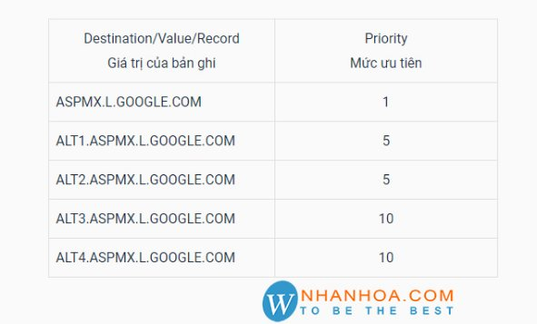

**TÌM HIỂU VỀ DNS , DOMAIN NAME, CÁC RECORD CƠ BẢN**

1. ## **Tìm hiểu DNS là gì?**
Hệ thống phân giải tên miền (hay được viết tắt là DNS do tên tiếng Anh Domain Name System) là một hệ thống cho phép thiết lập tương ứng giữa địa chỉ IP và tên miền trên Internet.

Hệ thống phân giải tên miền (DNS) về căn bản là một hệ thống giúp cho việc chuyển đổi các tên miền mà con người dễ ghi nhớ (dạng ký tự, ví dụ www.example.com) sang địa chỉ IP vật lý (dạng số, ví dụ 123.11.5.19) tương ứng của tên miền đó. DNS giúp liên kết với các trang thiết bị mạng cho các mục đích định vị và địa chỉ hóa các thiết bị trên Internet.

Phép so sánh thường được sử dụng để giải thích cho DNS là, nó phục vụ như một "Danh bạ điện thoại", có khả năng tìm kiếm và dịch tên miền thành địa chỉ IP. Ví dụ, www.example.com dịch thành 208.77.188.166. Tên miền Internet dễ nhớ hơn các địa chỉ IP, là 208.77.188.166 (IPv4) hoặc 2001: db8: 1f70:: 999: de8: 7648:6 e8 (IPv6).

Hệ thống phân giải tên miền phân phối trách nhiệm gán tên miền và lập bản đồ những tên tới địa chỉ IP bằng cách định rõ những máy chủ có thẩm quyền cho mỗi tên miền. Những máy chủ có tên thẩm quyền được phân công chịu trách nhiệm đối với tên miền riêng của họ, và lần lượt có thể chỉ định tên máy chủ khác độc quyền của họ cho các tên miền phụ. Kỹ thuật này đã thực hiện các cơ chế phân phối DNS, chịu đựng lỗi, và giúp tránh sự cần thiết cho một trung tâm đơn lẻ để đăng ký được tư vấn và liên tục cập nhật.

Nhìn chung, Hệ thống phân giải tên miền cũng lưu trữ các loại thông tin khác, chẳng hạn như danh sách các máy chủ email mà chấp nhận thư điện tử cho một tên miền Internet. Bằng cách cung cấp cho một thế giới rộng lớn, phân phối từ khóa – cơ sở của dịch vụ đổi hướng, Hệ thống phân giải tên miền là một thành phần thiết yếu cho các chức năng của Internet. Các định dạng khác như các thẻ RFID, mã số UPC, ký tự Quốc tế trong địa chỉ email và tên máy chủ, và một loạt các định dạng khác có thể có khả năng sử dụng DNS.

**+ Chức năng của DNS**

Mỗi website có một tên (là tên miền hay đường dẫn URL: Uniform Resource Locator) và một địa chỉ IP. Địa chỉ IP gồm 4 nhóm số cách nhau bằng dấu chấm(IPv4). Khi mở một trình duyệt Web và nhập tên website, trình duyệt sẽ đến thẳng website mà không cần phải thông qua việc nhập địa chỉ IP của trang web. Quá trình "dịch" tên miền thành địa chỉ IP để cho trình duyệt hiểu và truy cập được vào website là công việc của một DNS server. Các DNS trợ giúp qua lại với nhau để dịch địa chỉ "IP" thành "tên" và ngược lại. Người sử dụng chỉ cần nhớ "tên", không cần phải nhớ địa chỉ IP (địa chỉ IP là những con số rất khó nhớ).

**+ Nguyên tắc làm việc DNS**

Mỗi nhà cung cấp dịch vụ vận hành và duy trì DNS server riêng của mình, gồm các máy bên trong phần riêng của mỗi nhà cung cấp dịch vụ đó trong Internet. Tức là, nếu một trình duyệt tìm kiếm địa chỉ của một website thì DNS server phân giải tên website này phải là DNS server của chính tổ chức quản lý website đó chứ không phải là của một tổ chức (nhà cung cấp dịch vụ) nào khác.

**+ Cách sử dụng DNS**

Do các DNS có tốc độ biên dịch khác nhau, có thể nhanh hoặc có thể chậm, do đó người sử dụng có thể chọn DNS server để sử dụng cho riêng mình. Có các cách chọn lựa cho người sử dụng. Sử dụng DNS mặc định của nhà cung cấp dịch vụ (Internet), trường hợp này người sử dụng không cần điền địa chỉ DNS vào network connections trong máy của mình. Sử dụng DNS server khác (miễn phí hoặc trả phí) thì phải điền địa chỉ DNS server vào network connections. Địa chỉ DNS server cũng là 4 nhóm số cách nhau bởi các dấu chấm.
## **Trỏ DNS domain tên miền là gì?**
Hiểu theo cách đơn giản nhất là: Trỏ domain hay còn được gọi là trỏ tên miền là hành động bạn đăng nhập vào phần quản lý của domain (thông tin này sẽ được bên bán domain cung cấp cho bạn) để thực hiện cấu hình nó sao cho khi người dùng gõ tên domain này sẽ được tự động chuyển tới một địa chỉ hosting chứa website của bạn. Nó giúp bạn liên kết giữa tên miền và hosting chứa cái web của bạn.
1. ## ` `**Tên miền tiếng anh là gì?**
**Tên miền: (n) domain name**

Tên miền tiếng anh là domain name. Theo từ điển cambridge tên miền trong tiếng anh được định nghĩa như sau:

“the part of an [**email**](https://nhanhoa.com/tin-tuc/email-la-gi.html) or [**website**](https://nhanhoa.com/tin-tuc/website-la-gi.html) address on the internet that shows the name of the organization that the address belongs to” 

Dịch ra tiếng Việt nghĩa là một phần của địa chỉ email hoặc trang web trên internet, cái mà hiển thị tên của tổ chức mà địa chỉ đó thuộc về.

Hiểu đơn giản thì domain name là địa chỉ định danh của website trên internet. Tên miền thuộc về một cá nhân hoặc một tổ chức chủ sở hữu của trang web. Người dùng sẽ truy cập website thông qua việc tìm kiếm tên miền thông qua các trình duyệt tìm kiếm.

Bất kỳ trang web nào cũng cần phải có tên miền. Nếu không, người dùng sẽ phải tìm kiếm địa chỉ website bằng dãy IP rất dài và khó nhớ gồm 12 ký tự số. Vì thế, có thể hiểu domain là dãy ký tự thay cho địa chỉ IP lưu trên máy chủ.
##
## **2. Một số thuật ngữ liên quan đến tên miền trong tiếng anh**
\- [**Hosting**](https://nhanhoa.com/tin-tuc/hosting-website-la-gi.html): Nơi lưu trữ website. Tên miền phải trỏ về hosting để kết nối tên miền với không gian lưu trữ.

\- [**Whois**](https://nhanhoa.com/tin-tuc/whois-la-gi.html): Phương thức dùng để tra cứu thông tin tên miền

\- **Administrative Contact**: Người sở hữu tên miền. Được ghi trong bản ghi Whois của tên miền.

\- [**Domain name system**](https://nhanhoa.com/tin-tuc/dns-la-gi-tro-dns-domain-ten-mien-la-gi-huong-dan-tro-dns-tu-zonedns.html) (DNS): Hệ thống phân giải tên miền. Một hệ thống cho phép thiết lập tương ứng giữa IP và tên miền trên Internet.

\- **Domain Server**: Hệ thống máy chủ có chức năng quản lý tên miền. Một phần của [**cơ sở dữ liệu**](https://nhanhoa.com/tin-tuc/he-quan-tri-co-so-du-lieu.html) DNS.

\- **Keyword domain**: Tên miền có chứa từ khóa. Thường dùng khi nhắc đến một [**tên miền chuẩn SEO**](https://nhanhoa.com/tin-tuc/cach-chon-ten-mien-de-seo.html).

\- **Available domain**: Tên miền còn trống, có thể đăng ký và sử dụng

**- Transfer domain**: [**Chuyển nhượng tên miền:**](https://nhanhoa.com/tin-tuc/chuyen-nhuong-ten-mien.html)Là hình thức chuyển đổi chủ sở hữu tên miền khi tên miền vẫn còn thời gian sử dụng.

**- Dropping domain**: Một tên miền đã hết hạn đang chờ gia hạn thêm hoặc xóa. 

**- Internationalized Domain Name (IDN)**: Tên miền chứa các ký tự ngoài bảng chữ cái tiếng anh.Ví dụ như tên miền tiếng Việt nhân-hòa-.com

**- Address record:** Bản ghi địa chỉ, dùng để [**trỏ tên miền về hosting**](https://nhanhoa.com/tin-tuc/huong-dan-tro-ten-mien-ve-hosting.html). Thường dùng cho bên thứ ba.

**- Generic top level domain:** Tên miền cấp cao chung. Là tên miền quốc tế dùng chung không phân biệt quốc gia. Ví dụ như tên miền .com, .net,...

**- Country code top level domain:** Tên miền cấp cao quốc gia. Là tên miền đại diện cho từng quốc gia cụ thể. Ví dụ như .vn là tên miền Việt Nam, .uk là tên miền của nước Anh.

**- Sponsor top level domain:** Tên miền cấp cao nhất được tài trợ: Là tên miền chỉ được dùng cho một số nhóm hoặc tổ chức nhất định. Ví dụ như tên miền [**.gov**](https://nhanhoa.com/tin-tuc/ten-mien-gov-la-gi.html) dành cho các tổ chức chính phủ. Hoặc tên miền [**.mil**](https://nhanhoa.com/tin-tuc/ten-mien-cua-to-chuc-quan-su-thuong-chua-thanh-phan-gi.html) dành cho các tổ chức quân sự của Mỹ.

1. **Các Record cơ bản**

Giải nghĩa về DNS record, 6 loại DNS record phổ biến nhất

DNS record là một trong những thuật ngữ quan trọng mà hầu hết những người học về IT đều biết đến. Có khoảng 6 loại bản ghi DNS (DNS record) phổ biến và được sử dụng thường xuyên. CùngBizFly Cloud tìm hiểu qua bài viết sau đây nhé. 

Cloud Server - Giải pháp đám mây giúp vận hành website ổn định, nhanh chóng

Vậy DNS record là gì?

DNS (viết tắt của Domain Name System) là hệ thống tên miền giúp chuyển đổi tên miền website thành các địa chỉ IP (Internet Protocol) và ngược lại từ IP thành tên miền. Có thể nói, DNS là cơ sở dữ liệu chứa đựng IP address và tên miền. Nó giúp chuyển đổi tên miền (các chữ cái) thành các con số, chính là địa chỉ IP. Tức là khi bạn muốn truy cập một website, bạn chỉ cần nhớ tên miền của nó thay vì phải nhớ cả một dãy số IP… tất cả là nhờ vào hệ thống DNS.

DNS record là bản ghi nằm trong [DNS servers](https://bizflycloud.vn/tin-tuc/dns-server-la-gi-tac-dung-cua-dns-server-20180608161356343.htm "DNS servers") cung cấp thông tin về cơ sở dữ liệu DNS, cho biết các tên miền, địa chỉ IP gắn với tên miền và cách xử lý các yêu cầu với tên miền đó… Tất cả các tên miền trên internet đều phải có một vài bản ghi DNS cần thiết để người dùng có thể truy cập trang web khi nhập tên miền và thực hiện các mục đích khác.

Có khá nhiều loại DNS record, vậy đâu là những loại record phổ biến nhất cần biết?

6 loại DNS record phổ biến nhất
### *1. A record*
A record (viết tắt của Address record) là một bản ghi DNS cơ bản nhất. A record được dùng để đối chiếu một địa chỉ IP với tên miền. Nó được sử dụng để trỏ tên miền và tên miền phụ **([Subdomain](https://nhanhoa.com/tin-tuc/subdomain-la-gi.html))** tới một địa chỉ IP khi địa chỉ đó được xác định cụ thể và cố định. A record có cú pháp như sau:

[Tên miền] IN A [địa chỉ IP của máy]

Ví dụ: google.com IN A 172.217.5.78

Hầu hết các website chỉ có một bản ghi A, nhưng một số trang web sẽ có một vài bản ghi A không giống nhau. Điều này có nghĩa là một tên miền có thể được trỏ đến nhiều địa chỉ IP khác nhau… A record được dùng để chuyển tên miền sang địa chỉ IPv4, còn với IPv6 thì AAAA record sẽ được sử dụng. Cấu trúc của bản ghi AAAA cũng tương tự như bản ghi A.
### *2. CNAME record*
## **1. Cname Record là gì? Hạn chế của Cname Record là gì?**
### *- Khái niệm Cname Record là gì?*
Bản ghi CNAME (Canonical name Record) hay còn gọi là Bản ghi bí danh. Bản ghi CNAME cho phép một Server có thể có nhiều tên. Nói cách khác bản ghi CNAME cho phép nhiều tên miền cùng trỏ đến một địa chỉ IP cho trước

Để có thể khai báo bản ghi CNAME, bắt buộc phải có bản ghi kiểu A để khai báo tên của máy. Tên miền được khai báo trong bản ghi kiểu A trỏ đến địa chỉ IP của máy được gọi là tên miền chính (Canonical Domain). Các tên miền khác muốn trỏ đến máy tính này phải được khai báo là bí danh của tên máy (Alias Domain)

Cú pháp của bản ghi CNAME: Alias-Domain IN CNAME Canonical Domain

*Cname Record là gì? Hạn chế của Cname Record là gì?*
### *- Hạn chế của Cname Record*
Bản ghi CNAME phải luôn trỏ đến một tên miền khác và không bao giờ trực tiếp đến một địa chỉ IP. Bản ghi CNAME không thể cùng tồn tại với bản ghi khác cùng tên. Không thể có cả bản ghi CNAME và TXT cho [nhanhoa.com](https://nhanhoa.com/)

Một CNAME có thể trỏ đến CNAME khác. Mặc dù điều này thường không được khuyến nghị vì có thể ảnh hưởng đến hiệu suất. Khi áp dụng, CNAME phải trỏ càng gần tên mục tiêu càng tốt để tránh các chi phí hiệu suất không cần thiết
##
## **2. Hướng dẫn sử dụng Cname Record**
### *- Hướng dẫn tạo Cname cho Subdomain*
Để tạo Cname cho Subdomain bạn thực hiện theo những bước sau:

\+ Bước 1: Đăng nhập DNS Control

\+ Bước 2: Click vào Domain đã thêm vào hệ thống

\+ Bước 3: Xuất hiện bảng thông tin

\+ Bước 4: Nhập các giá trị yêu cầu để tạo bản ghi Cname cho Subdomain

DNS Record: Cname

Tên: Giá trị tên Subdomain

Giá trị: Giá trị của Cname (chỉ điền tên Domain đã xác định và không được ghi số IP)

MX: Để trống
### *- Hướng dẫn tạo Cname Record để xác thực các dịch vụ trực tuyến*
\+ Bước 1: Đăng nhập DNS Control

\+ Bước 2: Chọn Domain đã thêm vào hệ thống

\+ Bước 3: Xuất hiện bảng thông tin

\+ Bước 4: Điền các giá trị vào bảng thông tin
### *- Hướng dẫn thêm, nhập thông tin, cập nhật và xóa Cname Record*
#### *+ Thêm bản ghi Cname*
Bước 1: Trình chỉnh sửa bản ghi Cname

Bước 2: Bấm “Thêm”

Bước 3: Chọn Cname để thêm bản ghi mới

#### *+ Nhập thông tin bản ghi Cname*
Thông tin bản ghi Cname gồm:

Tên: Tên miền muốn tạo thêm

Nội dung: Tên máy chủ mà nó trỏ tới (không phải URL)

#### *+ Cập nhật bản ghi Cname*
Bước 1: Trong trình chỉnh sửa bản ghi Cname => tìm bản ghi muốn sửa

Bước 2: Chọn biểu tượng bút chì

Bước 3: Cập nhật thông tin

Bước 4: Nhấp vào “Cập nhật bản ghi” để lưu lại
#### *+ Xóa bản ghi Cname*
Bước 1: Trình trình sửa bản ghi => Tìm bản ghi Cname muốn xóa

Bước 2: Click vào biểu tượng thùng rác để xác nhận để xóa bản ghi

## **3. Lưu ý khi sử dụng bản ghi Cname**
\+ Bản ghi Cname luôn trỏ đến một Domain khác và không bao giờ trỏ trực tiếp đến địa chỉ IP

\+ Một bản ghi Cname không thể cùng tồn tại với một bản ghi khác cùng tên. VD: Không thể có cả bản ghi Cname và TXT cho [www.example.com](https://www.example.com/)

*Lưu ý khi sử dụng bản ghi Cname*

\+ Một bản ghi Cname có thể trỏ đến một Cname

\+ Không có mối quan hệ trực tiếp giữa bản ghi Cname và chuyển hướng HTTP, việc cấu hình Cname tự động cũng không dẫn đến bất kỳ chuyển hướng HTTP nào
### *3. MX record*
## **Bản ghi MX là gì?**

***Bản ghi MX (Mail Exchange Record)*** là một phần của DNS dùng để xác định máy chủ mail cho một tên miền. Nó có ảnh hưởng đến các tin nhắn phản hồi lại khi bạn sử dụng email theo tên miền riêng. Vì máy chủ thư khác muốn liên lạc lại với email server của bạn thì nó cần tìm bản ghi MX. 

Một tên miền có thể gán nhiều bản ghi MX, nên bạn có ngưng hoạt động email thì các dữ liệu trong đó vẫn được đảm bảo và lưu trữ 

Bản ghi MX không nhất thiết phải trỏ đến VPS, hosting, máy chủ của doanh nghiệp. Khi bạn dùng dịch vụ mail của bên thứ 3 thì bạn sẽ sử dụng bản ghi MX do họ cung cấp. 

DNS. DNS (Domain Name System) là hệ thống phân giải tên miền, có tác dụng thay đổi các UPL thành một địa chỉ IP. DNS bao gồm nhiều bản ghi với các tác dụng khác nhau nhưng đều phục vụ cho việc gửi và nhận email được diễn ra một cách nhanh và an toàn, cho phép thiết lập domain phụ và các dịch vụ khác. MX được đặt trên DNS.
##
## **Cấu trúc của một bản ghi MX**
Bản ghi MX có dạng 

nhanhoa.space    MX    10    mail.nhanhhoa.space.

mail.nhanhoa.space    A    103.101.181.201

Cấu trúc của bản ghi MX, sẽ chứa 2 trường: Priority và Exchange. Trong đó: 

\- Priority là vị trí ưu tiên cao nhất cho các loại mail mà bạn muốn nhận. độ ưu tiên càng cao thì số càng thấp.  Được hiển thị như sau:

` `nhanhoa.space MX 10 mail\_1.nhanhoa.space

` `nhanhoa.space MX 20 mail\_2.nhanhoa.space

` `nhanhoa.space MX 30 mail\_3.nhanhoa.space

Bạn nên sử dụng các cài đặt do bảng điều khiển và các nhà cung cấp đề xuất đến bạn. 

\- Exchange là mail server của người nhận thư. Địa chỉ này bắt buộc phải là tên chứ không phải IP và có sẵn record A. Dành cho những người dùng chưa biết, record A là bản ghi cơ bản và quan trọng nhất . Giúp trỏ tên miền của Web tới một địa chỉ IP cụ thể. 
## **Hướng dẫn tạo bản ghi MX trong DNS**
### **Đối với tên miền Việt Nam** 
*Bước 1:* Đăng nhập vào trang quản lý tên miền của bạn 

*Bước 2:* Chọn tab **Công cụ quản lý** -> **Quản lý bản ghi MX**. Cửa sổ mới mở ra và bạn điền các thông tin được yêu cầu một cách chính xác và đầy đủ nhất 

Như vậy là bạn đã hoàn thành bước tạo bản ghi MX  đối với tên miền Việt Nam. 
### **Đối với tên miền quốc tế**
*Bước 1:* Đăng nhập vào trang quản lý tên miền

*Bước 2:* Chọn **Công cụ quản lý** -> ***quản lý DNS*** để thay đổi cấu hình

Các thông tin mà bạn cần quan tâm ở đây bao gồm: 

\- Name – Tên máy chủ: @

\- Type – Loại: MX(Mail)

\- Address – Điạ chỉ: địa chỉ máy chủ sẽ xử lý mail, địa chỉ này bắt buộc phải là tên (không phải IP) và tên địa chỉ này đã có record A.

\- Mức độ ưu tiên: độ ưu tiên xử lý mail, số càng thấp thì record đó sẽ được ưu tiên trước. Tương tự như đối với tên miền Việt Nam.

Như vậy là bạn đã tạo xong bản ghi MX trong DNS đối với tên miền quốc tế.
###
### **Cách kiểm tra bản ghi MX trên DNS**
Bạn kiểm tra bản ghi DNS theo link sau: https://kiemtradns.com/

Lưu ý: sau khi cài đặt xong MX, hệ thống DNS cần 5 phút để cập nhật bản ghi và setup lại. 

Sau khi truy cập vào đường link trên, bạn gõ tên miền vào ô  **Enter domain name** -> **Loại bản ghi MX** -> **Check DNS Propagation**

Kết quả trả về sẽ hiển thị như sau

Nếu hệ thống hiển thị đủ 5 bản ghi nghĩa là DNS của bạn đã cập nhật các bản ghi MX

Còn nếu các trạng thái hiển thị là dấu X màu đỏ nghĩa là MX chưa được cập nhập trên DNS
##
## **Hướng dẫn trỏ bản ghi MX của Google**
*Bước 1:* Đăng nhập vào trang quản lý tên miền. sau đó chọn tên miền cần chỉnh sửa rồi ấn **Edit**

Sau đó điền 5 bản ghi MX như sau:

ASPMX.L.GOOGLE.COM

ALT1.ASPMX.L.GOOGLE.COM

ALT2.ASPMX.L.GOOGLE.COM

ALT3.ASPMX.L.GOOGLE.COM

ALT4.ASPMX.L.GOOGLE.COM

Các giá trị bạn nên chỉnh sửa như hiển thị trong hình sau

*Bước 2:* Click  **Thêm Record** để thêm bản ghi này vào phần các ô nhập cần thiết

Như vậy, đã hoàn thiện các bước trỏ bản ghi MX của Google
## **Các lưu ý khi cài đặt bản ghi MX**
\- Cần xóa các bản ghi MX cũ trước khi tạo bản ghi MX mới. Không nên để 2 bản ghi MX trên cùng DNS nhằm tránh hiện tượng các mail trả lời bị gửi đến lẫn lộn, hoặc không thể gửi mail

\- Bản ghi  ASPMX.L.GOOGLE.COM luôn phải đặt ở mức ưu tiên thấp nhất

\- Bạn chỉ quan tâm đến việc cài đặt bản ghi MX nếu bạn sử dụng email theo tên miền riêng. Một số nhà đăng ký đã cung cấp bản ghi MX ngay trong DNS của bạn, nếu muốn cập nhật hãy liên hệ để được hỗ trợ và hiểu rõ nhất tình trạng của DNS. 
### *4. TXT record*
**Bản ghi TXT là gì?**

Bản ghi txt là một loại DNS record giúp tổ chức các thông tin dạng text (văn bản) của tên miền. Người dùng có thể đẩy tất cả các văn bản không mất phí mà người dùng muốn lên một bản ghi TXT.

Một tên miền có thể có nhiều bản ghi TXT và chúng chủ yếu được dùng cho các SPF (Sender Policy Framework) codes, có tác dụng giúp máy chủ email xác định tính an toàn và nguồn gửi của các thư. Ngoài ra, bản ghi text trên DNS này còn dùng để xác thực máy chủ của một tên miền, xác minh SSL...

**Cách thêm bản ghi txt vào cấu hình DNS**

**Tìm hiểu về cấu hình DNS**

DNS (Domain Name System) hay hệ thống phân giải tên miền, có tác dụng chuyển đổi các tên miền website sang một địa chỉ IP dạng số tương ứng và ngược lại. Theo cơ chế chỉ một hệ thống cho phép thiết lập tương ứng giữa địa chỉ IP và tên miền. DNS có chức năng phiên dịch địa chỉ IP thành những dãy số đơn giản, giúp người dùng dễ ghi nhớ; đẩy nhanh quá trình duyệt internet. 

**Bản ghi txt là gì? Hướng dẫn thêm bản ghi txt vào cấu hình DNS**

***Bước 1:*** Đăng nhập vào tài khoản email của bạn vào Admin console sau khi truy cập vào link admin.google.com .

Nhấn chọn Domains

***Bước 2:***  Chọn Add/remove trong Domains

***Bước 3:*** Nhấn chọn  Add a domain or a domain alias như hình dưới đây 

Sau đó một cửa sổ mới sẽ hiện ra và bạn chọn  Add another domain.

Nhấn Continue và Verify domain ownership để tiếp tục công việc 

***Bước 4:*** Chọn Recommended method -> Other.

Ở mục Add the TXT record below to the DNS configuration for… bạn tìm TXT record copy sau đó paste vào trang quản lý domain.

Cuối cùng nhấn vào Verify để trở lại bảng quản lý.

***Bước 5:*** Đăng nhập lại vào trang quản lý tên miền bạn sẽ thấy cấu hình bản ghi txt ở ngay dưới mục cấu hình DNS. Điền các thông tin như sau 

- Mục Host: điền @
- Mục loại: chọn TXT
- Mục địa chỉ: bản ghi TXT vào tên miền được cho bên trên.

Cuối cùng chọn continue để hoàn thành quá trình cài đặt 
### *5. NS record*
NS (Name Server) record là một loại DNS record giúp xác định thông tin của một tên miền cụ thể được khai báo và quản lý trên máy chủ nào. Cú pháp của bản ghi này như sau:

[Tên miền] IN NS [tên máy chủ tên miền]

Ví dụ:

abc.com IN NS ns1.abc.vn

abc.com IN NS ns2. abc.vn

Trong ví dụ trên, tên miền abc.com sẽ được quản lý bởi hai máy chủ tên miền là ns1. abc.vn và ns2. abc.vn. Điều này cũng có nghĩa là các DNS record (A record, MX record…) của tên miền abc.com sẽ được khai báo trên hai máy chủ này.
### *6. PTR record*
## **1. Giới thiệu PTR Record, PTR là gì?**

**PTR là gì**? PTR hay PTR Record Point Record được dịch ra tiếng việt với nghĩa là bản ghi ngược, hay còn được gọi là Reverse DNS.

**Bạn hãy hiểu đơn giản đây là một bản ghi thực hiện việc chuyển một địa chỉ IP đến tên miền.** PTR record giống như một phiên bản ngược của A record: nếu A record trỏ tên miền vào một địa chỉ IP thì PTR Record trỏ một địa chỉ vào một hostname. Nhưng 2 bản ghi này làm việc hoàn toàn độc lập không liên quan đến nhau.

*Ví dụ: nếu A record của Nhân Hoà trỏ tới 12.11.168.xx, trong khi 13.13.168.xx trỏ tới một hostname hoàn toàn khác.*
###
### **So sánh tên miền ngược và tên miền thông thường**

Tên miền ngược cũng được xây dựng không gian theo cơ chế phân cấp giống như tên miền thông thường
### **Cấu trúc: ddd.ccc.bbb.aaa.in-addr. arpa.**
**Trong đó:** aaa, bbb, ccc, ddd là các số viết trong hệ thập phân biểu diễn giá trị của 4 byte cấu thành địa chỉ IP.

\+ .arpa là mức cao nhất trong mọi không gian tên miền ngược (áp dụng với cả IPv4 và IPv6).

\+ in-addr.arpa là mức cao nhất trong không gian tên miền ngược áp dụng với thế hệ địa chỉ IPv4.

\+ ip6.arpa là mức cao nhất trong không gian tên miền ngược áp dụng với thế hệ địa chỉ IPv6.

*Ví dụ: Một máy tính trên mạng có địa chỉ IP là 121.011.26.18 thì tên miền ngược ứng với nó sẽ là 18.26.011.121.in-addr. arpa.*
## **2. Lý do bạn cần PTR là gì?**
Đây là phần quan trọng nhất Nhân Hoà muốn chia sẻ đến bạn về thông tin **PTR là gì?** Qua đó, bạn có thể cân nhắc và áp dụng dễ dàng hơn trong quá trình sử dụng.

Sẽ có rất nhiều lý do để bạn lựa chọn bản ghi PTR hay PTR Record. Cụ thể như:
### **Đáp ứng yêu cầu reverse DNS lookup trước khi nhận email**
Bạn có thể chuyển đổi từ tên miền sang địa chỉ IP nhờ vào sự cho phép của hệ thống tên miền thuận. Nhưng có rất nhiều trường hợp với một số dịch vụ Internet đòi hỏi hệ thống máy chủ DNS phải có chức năng chuyển đổi ngược từ địa chỉ IP sang tên miền. PTR Record (tên miền ngược) ra đời nhằm phục vụ mục đích này.
### **Tăng độ tin cậy của server: (hỗ trợ cho outgoing mail server)**
Với PTR Record bạn có thể tuỳ ý kiểm tra điểm nhận cuối cùng đối chiếu IP của hostname gửi tới. Đây là một cách hữu hiệu để chống lại hầu hết các hacker sử dụng tên miền giả để spam mail.

Bạn nên cập nhật PTR Record thường xuyên vì:

\+ Cần chứng thực domain đó khi phân giải ngược đúng IP server.

\+ Tên miền phân giải ngược đó là duy nhất cho server của bạn như mail server.
## **3. Quy trình kiểm tra PTR là gì?**

Hãy tìm hiểu xem quy trình kiểm tra PTR như thế nào để có cái nhìn tổng quan hơn về thông tin **PTR là gì**?

Khi nhận được một yêu cầu nhận mail từ 1 địa chỉ IP bất kỳ trên Internet, mail server sẽ tiến hành rà soát địa chỉ IP đó xem host name là gì, Host name đó có nằm trong MX Record của tên miền của email gửi đến không. Nếu không khớp thì mail đó sẽ bị liệt vào danh sách mail spam.
### **Cách 1: Kiểm tra PTR với nslookup hoặc dig**
Tính năng để thực hiện kiểm tra DNS records đều được tích hợp với các hệ điều hành Windows, Linux và MacOS.
#### ***Khi sử dụng hệ điều hành Windows***
**Bước 1:** Gõ cmd sau khi đã truy cập vào mục Start Menu của Windows. Tiếp đó hãy nhấn Enter để đến cửa sổ Command Prompt.

**Bước 2:** Copy dòng lệnh sau để lấy hostname của địa chỉ IP (đổi biến IP\_ADDESS thành địa chỉ IP).
#### *nslookup IP\_ADDRESS*
#### ***Khi sử dụng hệ điều hành Linux và MacOS***
**Bước 1:** Với hệ điều hành MacOS bạn hãy tiến hành truy cập terminal từ launcher (F4). Một số Linux distribution cho phép truy cập vào terminal chỉ bằng cách nhấn Ctrl+Alt+T.

**Bước 2:** Sử dụng lệnh dưới đây để kiểm tra record (đổi biến IP\_ADDRESS thành IP thật).
### *dig -x IP\_ADDRESS*
### **Cách 2: Sử dụng tool online để kiểm tra PTR**

**Bước 1:** Chờ DNS cập nhật sau khi đã trỏ bản ghi PTR.

Link truy cập: [**https://mxtoolbox.com/SuperTool/**](https://mxtoolbox.com/SuperTool.aspx?action=mx%3a&run=toolpage)

**Bước 2:** Nhập IP server của bạn

**Bước 3:** Để tiến hành kiểm tra IP chọn Reverse Lookup.

Ngoài 6 loại trên vẫn còn các loại bản ghi DNS khác ít phổ biến như SOA record, SRV record, APL record, CAA record, NAPTR record…

