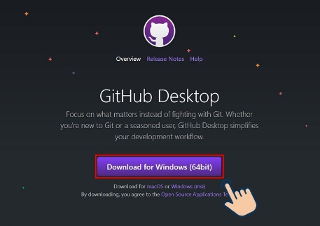
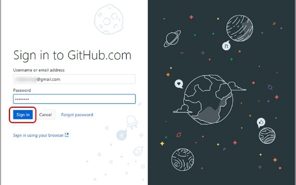

**GITHUB**

1. **Github là gì?**

GitHub là một dịch vụ cung cấp [kho lưu trữ mã nguồn](https://vi.wikipedia.org/w/index.php?title=Kho_l%C6%B0u_tr%E1%BB%AF_m%C3%A3_ngu%E1%BB%93n&action=edit&redlink=1 "Kho lưu trữ mã nguồn (trang không tồn tại)") [Git](https://vi.wikipedia.org/wiki/Git_\(ph%E1%BA%A7n_m%E1%BB%81m\) "Git (phần mềm)") dựa trên nền web cho các dự án phát triển phần mềm. GitHub cung cấp cả phiên bản trả tiền lẫn miễn phí cho các tài khoản. Các dự án [mã nguồn mở](https://vi.wikipedia.org/wiki/Ph%E1%BA%A7n_m%E1%BB%81m_ngu%E1%BB%93n_m%E1%BB%9F "Phần mềm nguồn mở") sẽ được cung cấp kho lưu trữ miễn phí. Ngoài ra nó còn bổ sung những tính năng về social để các developer tương tác với nhau.Nó như là một hệ thống quản lý dự án và phiên bản code, hoạt động giống như một mạng xã hội cho lập trình viên. Các lập trình viên có thể clone lại mã nguồn từ một repository và Github chính là một dịch vụ máy chủ repository công cộng, mỗi người có thể tạo tài khoản trên đó để tạo ra các kho chứa của riêng mình để có thể làm việc.

- *Tính năng của Github*

**GitHub** được coi là một mạng xã hội dành cho lập trình viên lớn nhất và dễ dùng nhất với các tính năng cốt lõi như:

1. Wiki, issue, thống kê, đổi tên project, project được đặt vào namespace là user.
1. Watch project: theo dõi hoạt động của project của người khác. Xem quá trình người ta phát triển phầm mềm thế nào, project phát triển ra sao.
1. Follow user: theo dõi hoạt động của người khác.

Có 2 cách tiếp cận GitHub: Tạo project của riêng mình Contribute cho project có sẵn: fork project có sẵn của người khác, sửa đổi, sau đó đề nghị họ cập nhật sửa đổi của mình (tạo pull request).

- *Một vài khái niệm của Git bạn cần nắm*
- **git**: là prefix của các lệnh được sử dụng dưới CLI
- **branch**: được hiểu như là nhánh, thể hiện sự phân chia các version khi 2 version đó có sự sai khác nhất định và 2 version đều có sự khác nhau.
- **commit**: là một điểm trên cây công việc (Work Tree ) hay gọi là cây phát triển công việc
- **clone**: được gọi là nhân bản, hay thực hiện nhân bản. Sử dụng để clone các project, repository trên các hệ thống chạy trên cơ sở là git, ví dụ như: bitbucket, github, gitlab, cor(1 sản phẩm mã nguồn mở cho phép người dùng tự tạo git server cho riêng mình trên vps, server),… Việc clone này sẽ sao chép repository tại commit mình mong muốn, dùng để tiếp tục phát triển. Thao tác này sẽ tải toàn bộ mã nguồn, dữ liệu về máy tính của bạn.
- **folk**: Folk là thao tác thực hiện sao chép repository của chủ sở hữu khác về git account của mình. sử dụng và đối xử như 1 repository do mình tạo ra.
- **repository**: Kho quản lý dữ liệu, là nơi lưu trữ các dữ liệu, mã nguồn của project.
- **tag**: sử dụng để đánh dấu một commit khi bạn có quá nhiều commit tới mức không thể kiểm soát được.
- **remote**: sử dụng để điều khiển các nhánh từ một repository trên git server, đối xử với các nhánh trên remote tương tự như đối xử với các nhánh trên local
- **diff:** So sánh sự sai khác giữa phiên bản hiện tại với phiên bản muốn so sánh, nó sẽ thể hiện các sự khác nhau
- **.gitignore:** file mặc định của git sử dụng để loại bỏ (ignore) các thư mục, file mà mình không muốn push lên git server
- *Lợi ích của Github đối với lập trình viên*
- ### **Quản lý source code dễ dàng**
- Khi bạn tạo một repo, toàn bộ source code của repo đó được lưu trên GitHub. Tại đây, bạn có thể coi lại quá trình mình đã làm việc thông qua các comment sau mỗi lần commit. Và cái hay ở đây, là nhiều người có thể cùng làm một repo.
- Lợi ích đầu tiên, chính là bạn biết được ai đã commit và commit cái gì. Tiếp theo, source của bạn có thể phát triển theo nhiều nhánh. Nguyên tắc làm việc với các nhánh như thế này: Bạn có thể rẽ nhiều nhánh để phát triển project. Nhưng cuối cùng, bạn phải merge lại vào nhánh MASTER để ra được project hoàn chỉnh.
- ### **Tracking sự thay đổi qua các version**
- Khi có nhiều member cùng thực hiện một dự án thì khá là phức tạp để theo dõi revisons – ai thay đổi cái gì, lúc nào và mấy cái files đó được stored ở đâu. Đừng lo vì GitHub đã tính đến chuyện này giúp bạn, bằng cách luôn lưu lại những thay đổi bạn đã push lên repository. Cũng tương tự với Microsoft Word hay Google Drive, bạn có một lịch sử phiên bản để phòng trường hợp các phiên bản trước đó bị mất hay không được lưu.
- ### **Markdown**
- Markdown là một cách định dạng text trên web. Bạn có thể chỉnh sửa cách hiển thị của document, format từ như định dạng **in đậm** hay *in nghiêng*, thêm hình và tạo list những thứ bạn có thể làm với Markdown. Hầu hết, Markdown chỉ là đoạn text đơn thuần với những ký tự đặc biệt chèn vào, như # hay \*. Trong GitHub thì bạn có thể sử dụng Mardown ở những nơi: Git, Comments tại Issues và Pull Requests, các file có đuôi .md hay .markdown extension.
- ### **Github giúp cải thiện kỹ năng code, thậm chí là tracking bug**
- Có hàng ngàn hàng vạn cách để học, học trên Github sẽ là một ý kiến không tồi trong thời đại này. Với hàng vạn open source projects, hàng trăm ngàn contributors, hàng tỉ commit mỗi ngày thì chỉ bằng việc xem. So sánh, học tập từ những thay đổi đó đã đem lại cho bạn hàng tá điều hay để cải thiện kỹ năng code của bản thân mình.
- “Bug tracking” là một tính năng được GitHub tích hợp vào để đơn giản hóa quá trình “tìm và diệt bọ”. Để hiểu được quy trình thì những gì bạn cần làm là mở dashboard của từng project lên và filter các thông tin. Sau đó, các câu hỏi sẽ được hệ thống, sắp xếp theo mức độ phổ biến, thời gian update hay tương tại. Phần mềm này cũng có giao diện khá mượt nên luôn được xếp hạng cao trong cộng đồng IT dev.
- ### **Github là một kho tài nguyên tuyệt vời**
- Với chức năng Explore, bạn có thể theo dõi, tìm kiếm những open source projects theo đúng technology pattern mà bạn ưa thích. Github hỗ trợ code search không kể nó ở dưới dạng một project riêng biệt hay là website. Ngoài ra, nền tảng này cũng có SEO khá tốt nên người dùng có thể tìm kiếm bất kỳ code string nào được chia sẻ public.
- ### **Github Action**
- Trên server của Github có những workflow scripts chạy tự động. Dev có thể dùng chúng để phản hồi các events trên repositories hoặc thực hiện vài action. Ví dụ như tôi có viết một cái tiện ích nho nhỏ, [Autotagger – GitHub Marketplace](https://github.com/marketplace/actions/autotagger "github.com"), sẽ tự động tạo git tafs khi mà số phiên bản của package.json thay đổi. Nhìn thì đây chỉ là hành động nhỏ nhưng sẽ có tác động rất lớn khi phải truy tìm code ngược về bản phát hành, và bớt đi một cơn “nhức đầu” cho các project maintainers đó chứ.

- ### **Github Package Registry**
- Cái package registry này cho phép lập trình viên duy trì distribution registries của họ, bao gồm npm, docker, maven, nuget và Ruby gems.

- Đừng ngần ngại mà không tạo ngay cho mình một tài khoản Github. Tạo những project của riêng mình và chia sẻ với mọi người, hoặc bạn có thể thoải mái fork một project của một open source nào đó. Tạo pull request hoặc issues nếu như tìm được lỗi, cần support.
1. **Tạo tài khoản Github**

***2.1 Hướng dẫn nhanh***

Vào trang web Gihub > Nhập đầy đủ thông tin tài khoản của bạn và nhấn Sign up for Github > Vào Email để kích hoạt tài khoản.
#### ***2.2 Hướng dẫn chi tiết***
**Bước 1:** Đầu tiên bạn vào [trang web Gihub](https://github.com/). Sau đó nhập đầy đủ **thông tin tài khoản** của bạn và nhấn **Sign up for Github.**

Nhập đầy đủ thông tin tài khoản của bạn và nhấn Sign up for Github

**Bước 2:** Lúc này bạn hãy vào **Email để kích hoạt tài khoản** của mình nhé.

`              `Vào Email để kích hoạt tài khoản của mình
- ### ` `**Cách tải và cài đặt Github** 
#### ***1. Hướng dẫn nhanh***
Vào [trang web tải Github](https://desktop.github.com/) > Chọn **Dowload for Windows (64Bit)** > Click vào **file vừa tải về** > Ứng dụng đã được **cài đặt** > chọn **Sign in to GitHub.com** > Bạn nhập tên đăng nhập và mật khẩu, sau đó chọn **Sign in** > nhập tên và email để hiển thị trong giao diện GitHub, nhấn **Continue** > nhấn **Finish.**
#### ***2. Hướng dẫn chi tiết***
**Bước 1:** Vào [trang web tải Github](https://desktop.github.com/) và họn **Dowload for Windows (64Bit)**.

Vào trang web tải Github và họn Dowload for Windows (64Bit).

**Bước 2:** Click vào **file vừa tải về**. Lúc này ứng dụng sẽ tự động cài đặt vào máy của bạn.

Click vào file vừa tải về. Lúc này ứng dụng sẽ tự động cài đặt vào máy của bạn.

**Bước 3:** Sau khi **cài đặt thành công** bạn có thể đăng nhập tài khoản mình vừa tạo ở phía trên để sử dụng bằng cách chọn **Sign in to GitHub.com**

Sau khi cài đặt thành công bạn có thể đăng nhập tài khoản mình vừa tạo ở phía trên để sử dụng.

**Bước 4:** Bạn nhập tên đăng nhập và mật khẩu, sau đó chọn **Sign in.**

Bạn nhập tên đăng nhập và mật khẩu, sau đó chọn Sign in.

**Bước 5:** Bạn nhập tên và email để hiển thị trong GitHub, sau đó nhấn **Continue.**

nhấn Continue

**Bước 6:** Nhấn **Finish.**

Nhấn Finish.

Bạn đã có thể sử dụng GitHub rồi!

Giao diện GitHub
####
**2.  Cách viết bài và đẩy bài lên github**

**Bước 1: Tạo một repository mới trên Github** 

\- Sau khi đăng kí tài khoản thành công, tạo một repo mới:

Chọn new repository để tạo repo mới

\- Đặt tên cho repo mới, sau đó click Create Repository. Lưu ý: Nếu các bạn muốn triển khai một website tĩnh trên Github, các bạn phải đặt tên repo theo cú pháp sau: [username của tài khoản Github của bạn].github.io

Tạo repo trên Github

\- Trong ảnh trên, tại thời điểm viết bài thì mình đã có một repo có tên là handuy.github.io, do đó Github sẽ báo lỗi là repo đã tồn tại. Trường hợp các bạn tạo repo mới thì sẽ không gặp lỗi này.  Sau khi đặt tên cho repo xong thì các bạn click Create repository

Tạo repo thành công

**Bước 2: Clone repo về máy**

\- Copy đường dẫn của repo mới tạo

Đường dẫn (bôi xanh) của repo mới tạo

\- Clone repo về máy bằng lệnh sau:

$ git clone https://github.com/handuy/handuynew.github.io.git

Bước 4: Thêm/sửa/xóa file/thư mục trên repo vừa clone về, sau đó push lên Github

\-  Thêm/sửa/xóa các file/thư mục trên repo vừa clone về, sau đó lần lượt chạy từng lệnh sau:

$ git add .

$ git commit -m "điền nội dung commit vào đây"

$ git push origin master

Các bước đẩy code lên Github

\- Vào Github repo để kiểm tra

